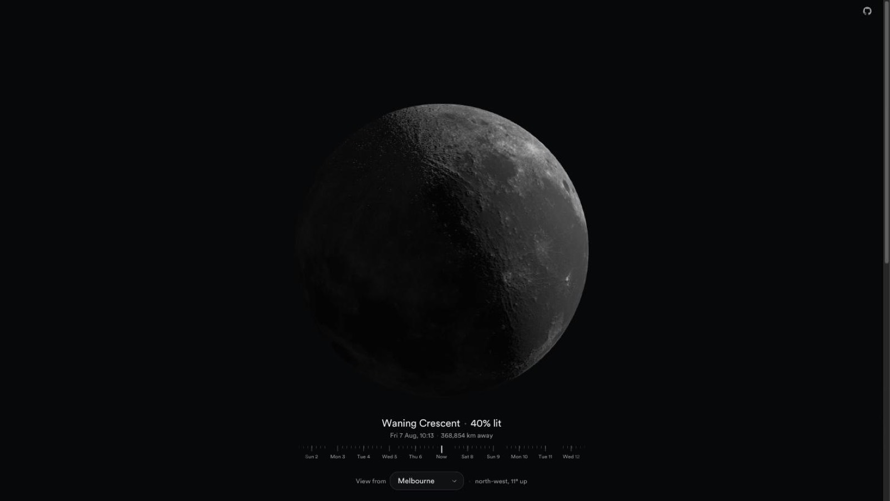

# [Moon Phases](https://blode.co/moon)

**See tonight's moon as it looks from where you are, then scrub through the lunar cycle**

Pick your city, read the phase and illumination, and watch the crescent lean the way it really leans at your latitude.

  

## Demo

A physically lit moon, mapped with NASA Lunar Reconnaissance Orbiter surface data.

## What you can do

- **Read the phase:** phase name, lit fraction, and distance in kilometres for the moment you are looking at.
- **Find it in the sky:** a compass bearing and altitude, or a note that it is below the horizon.
- **Travel in time:** scrub forwards and back a whole day per step, and watch the terminator sweep across real craters.
- **Set where you are viewing from:** a city list, or "Use my location" for your exact latitude.

## How it is built

- **The phase is computed, never animated:** sun direction, illumination, and orientation come from real Sun and Moon geometry via [astronomy-engine](https://github.com/cosinekitty/astronomy).
- **The moon is tidally locked, as it is in life:** the sphere holds still and the light moves around it.
- **The scene frame is zenith-up:** so a crescent from Melbourne leans differently from one in London, which is the point of the page.
- **The maths is cross-checked:** the lit fraction is verified against `Illumination()` and the bright-limb angle against a closed-form Meeus solution implemented independently.

## Notes

- Requires WebGL and a browser with JavaScript enabled.
- Surface relief is a NASA LRO normal map (albedo, normal, and roughness, 2048x1024 WebP).
- Your city is guessed from the browser timezone, so nothing is requested on load and no geolocation prompt appears until you ask for it.

## License

MIT

---

Crafted by  [Matthew Blode](https://blode.co)
